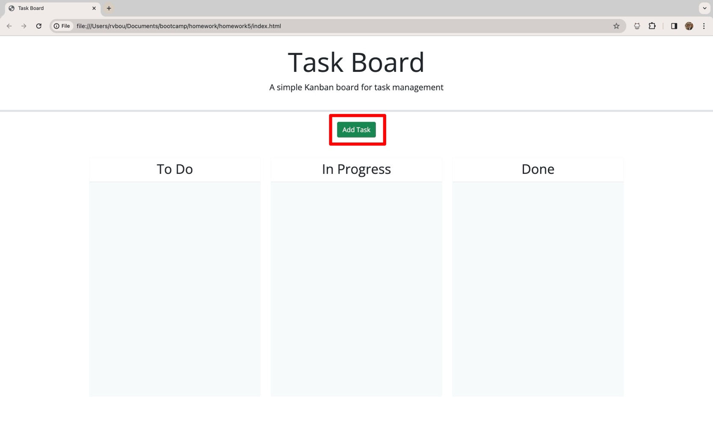
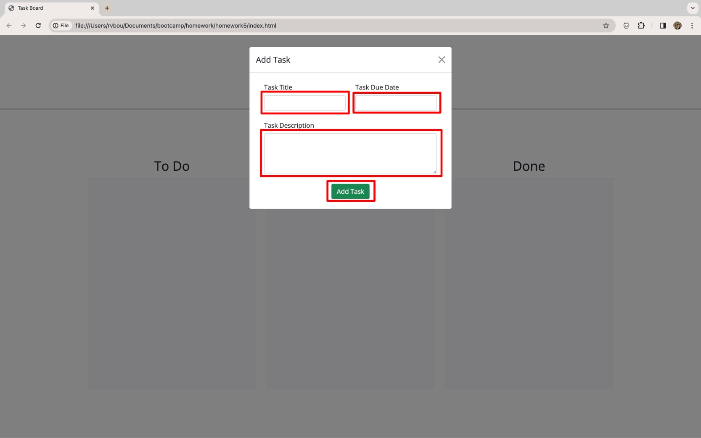
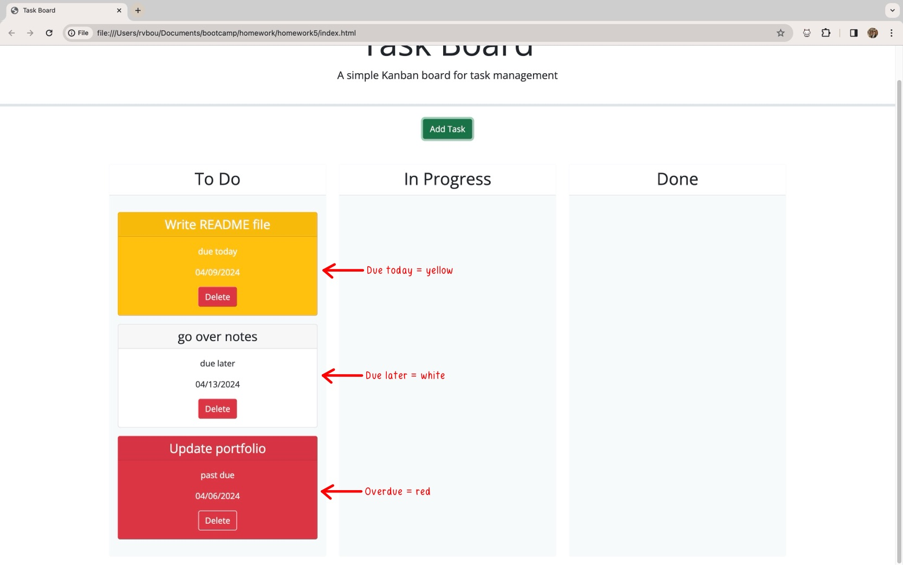
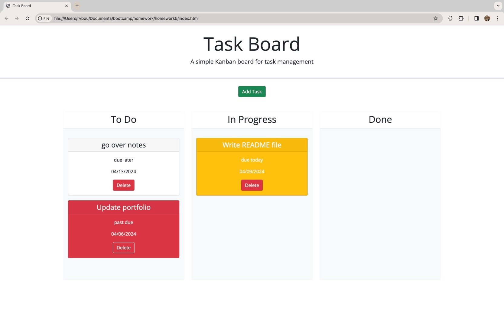
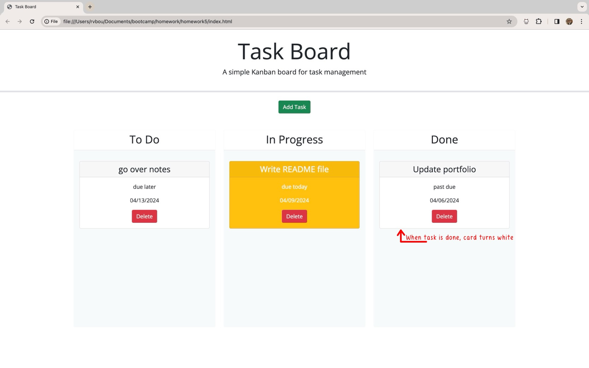

# Task Board

## Description

This Task Board application is a simple task board that allows a team to manage project tasks. It includes a modal form where users will input the name of their task, due date, and description. The task list be savedd to localStorage and dynamically generated to each task lane.

## Usage

When a user first opens the application, they are greeted with a task board with three lanes and an 'Add Task" button.

When they click the button, a modal form will pop up with three input areas: Task Title, Task Date (a date picker when clicked), and Task Description. After the user fills out the fields and clicks the "Add Task" button,

the modal form will close automatically and their task will be set in the default lane. Tasks are colored by due date.

the user will be able to drag each task between all three lanes: To Do, In Progress, and Done.

When a task is placed in the "Done" lane, the card will turn white: this signifies the task is complete.

The user will also be able to delete individual tasks by clicking the red "Delete" button on the respective task.

## Screenshot

## Deployed Application

[Click here](https://rvbouu.github.io/task-board/) to view the deployed version.